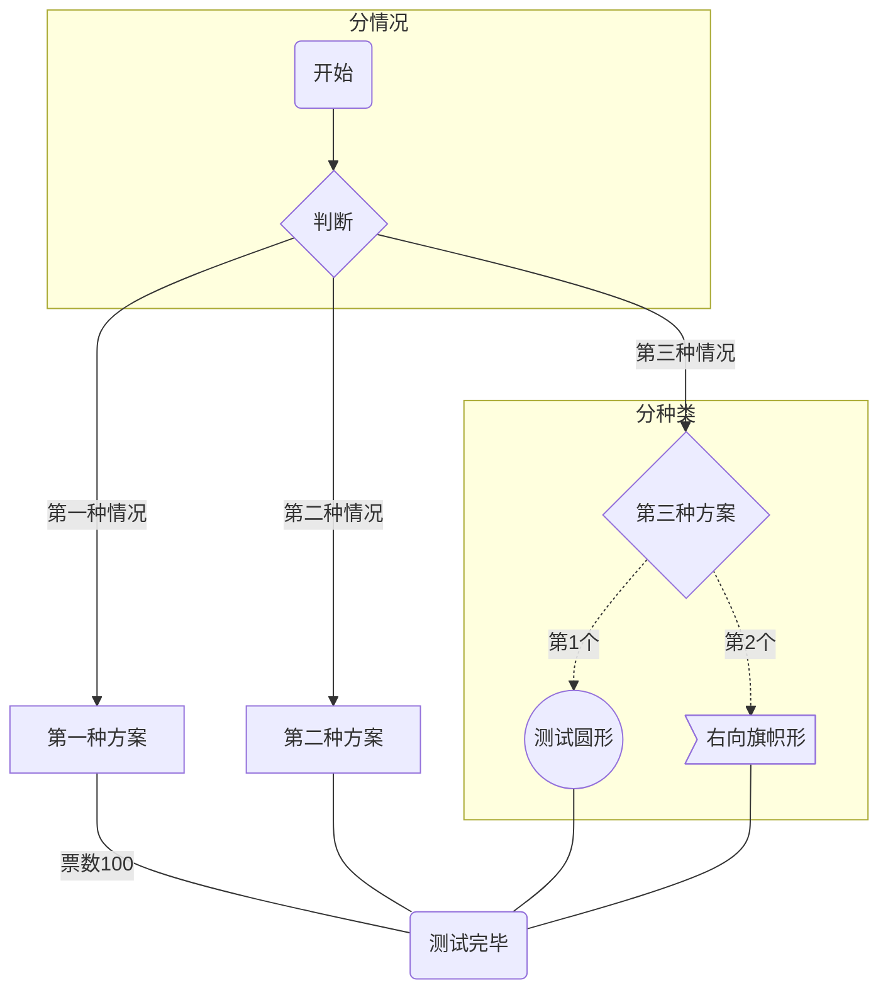
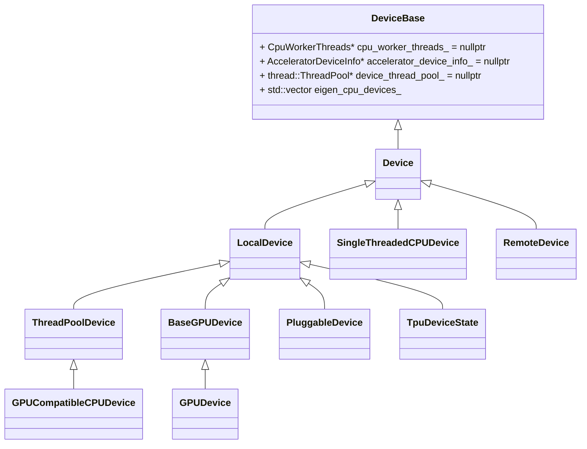

###【2023-02-08】【Doing】了解cvr召回现状和代码
* **【背景&&动机】**
&emsp;接手cvr召回工作
* **【进展】**
&emsp;CVR 召回用全场景的ctr数据做为负样本，订单作为正样本

* **【todo】**
&emsp;cvr的样本空间比较小，意味着大部分视频没有经过模型的训练，考虑用多目标扩大样本空间。
* &emsp;  kkk

### 【2023-02-07】【doing】基于ua的数据看板 shuangzhu.kang@shopee.com 
* 【背景】
  * 把ua数据接grafana，更快的观察实验结果和更新状态
* 【进展】
  * 放弃了之前把每条请求的所有行为聚合到一起的方法，把数据存成两个表，
  * 表1：把每个行为存储为一条数据，利用ck的mergetree对行为的eventtime去重实现每个行为的去重。
  * 表2：利用观看时长去重获取请求数量，是观看时长和视频时长。
  * 目前10s维度的轻度聚合表已经写入，数据验证中
* 【todo】
  * 验证数据，接入grafana