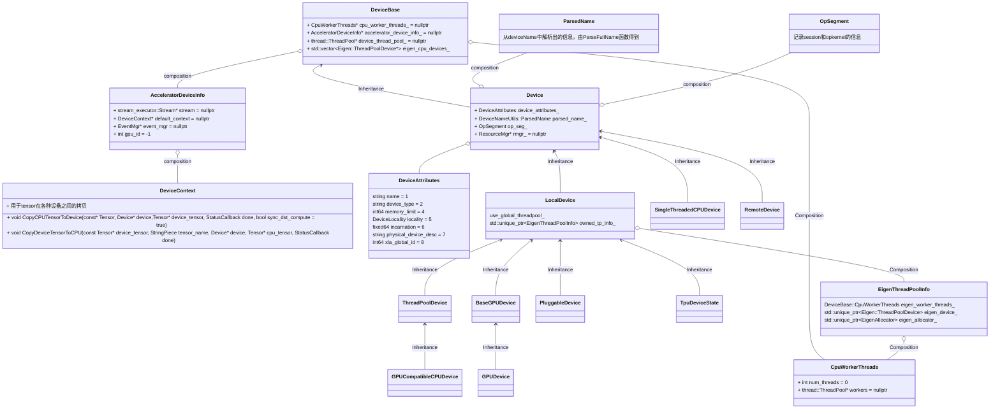

tensorflow中的device是一个非常重要的概念，在device中定义了

device相关的对象继承关系非常杂，下图所示：


其中localDevice的各种子类由各种factory生成。syclDevice在最新版本的tensorflow中已经换成了plugindevice等设备。不过这些设备都不常用，所以我们把注意力放在localDevice中就好。


我们先来看deviceBase
## DeviceBase
&emsp;DeviceBase是device的基类。主要的属性如下：
>  Env* const env_;\
  CpuWorkerThreads* cpu_worker_threads_ = nullptr;\
  // Set by GPUs as well as by TPU devices. \
  AcceleratorDeviceInfo* accelerator_device_info_ = nullptr; \
  thread::ThreadPool* device_thread_pool_ = nullptr; \
  std::vector<Eigen::ThreadPoolDevice*> eigen_cpu_devices_;

其中Env是对操作系统相关功能的统一封装，包括了文件系统等功能

CpuWorkerThreads 是一个结构体，定义如下：

```cpp
  struct CpuWorkerThreads {
    int num_threads = 0;
    thread::ThreadPool* workers = nullptr;
  };
```
可以看到cpu_worker_threads_其实就是对线程池的简单封装


accelerator_device_info_,在很多博客中叫 gpu_device_info_, 是一个用于描述gpu或者其他设备的结构体，结构体的定义为
```cpp
  struct AcceleratorDeviceInfo {
    // Make sure all the defaults are NULL, so we can spot missing assignments.
    stream_executor::Stream* stream = nullptr;
    DeviceContext* default_context = nullptr;
    EventMgr* event_mgr = nullptr;
    int gpu_id = -1;
  };
```
这里面有一个属性DeviceContext，定义如下：

```cpp
class DeviceContext : public core::RefCounted {
  public:
    //...
    virtual void CopyCPUTensorToDevice(const Tensor* cpu_tensor, Device* device, Tensor* device_tensor, StatusCallback done) const;
    virtual void CopyDeviceTensorToCPU(const Tensor* device_tensor, StringPiece tensor_name, Device* device, Tensor* cpu_tensor, StatusCallback done);
};
```

可以看到DeviceContext的主要作用就是提供两个接口，用于tensor在cpu和其他设备之间的相互拷贝

device_thread_pool_ 也是一个线程池

eigen_cpu_devices_ Eigen库定义的ThreadPoolDevice类。

用一张图来表示device的属性


deviceBase的函数基本全都是虚函数，所以等到具体实现的时候再做介绍。


## device

deviceBase 只有一个子类就是device，device定义在tensorflow/core/framework/device.h， tensorflow/core/framework/device.cc。主要属性如下：

>   DeviceAttributes device_attributes_; \
  DeviceNameUtils::ParsedName parsed_name_; \
  // op_seg_ maps session handle and op name to OpKernel objects. \
  OpSegment op_seg_; \
  // Resources associated w/ this device. E.g., shared variables, etc. \
  ResourceMgr* rmgr_ = nullptr;


其中 DeviceAttributes 是一个被proto定义的对象，proto 路径为tensorflow/core/framework/device_attributes.proto。DeviceAttributes定义如下：

```cpp
message DeviceAttributes {
  // Fully specified name of the device within a cluster.
  string name = 1;

  // String representation of device_type.
  string device_type = 2;

  // Memory capacity of device in bytes.
  int64 memory_limit = 4;

  // Platform-specific data about device that may be useful
  // for supporting efficient data transfers.
  DeviceLocality locality = 5;

  // A device is assigned a global unique number each time it is
  // initialized. "incarnation" should never be 0.
  fixed64 incarnation = 6;

  // String representation of the physical device that this device maps to.
  string physical_device_desc = 7;

  // A physical device ID for use in XLA DeviceAssignments, unique across
  // clients in a multi-client setup. Set to -1 if unavailable, non-negative
  // otherwise.
  int64 xla_global_id = 8;
}
```

parsed_name_ 被拆解的设备名称, 一般是设备名称的格式类似于“/job:train/replica:0/task:3/gpu:2”， parsed_name_ 表示对这个名称拆解。具体的拆解方法在函数tensorflow/core/util/device_name_utils.cc  的ParseFullName中。

ResourceMgr  resource的管理类，定义在tensorflow/core/framework/resource_mgr.h  resource是指在不同节点，不同设备之间共享的tensor, 队列等各种数据。


OpSegment用于记录session和kernel之间的意义对应关系，OpSegment定义在tensorflow/core/framework/op_segment.h， 其核心的属性是std::unordered_map<string, Item*> SessionMap，key是session_name， value 是包装了kernel的结构体。

Device对象的函数同样大多数都是虚函数，还有一些是非常简单的返回一个属性的函数，所以只介绍一下构造函数：

```cpp
Device::Device(Env* env, const DeviceAttributes& device_attributes)
    : DeviceBase(env), device_attributes_(device_attributes) {
  CHECK(DeviceNameUtils::ParseFullName(name(), &parsed_name_))
      << "Invalid device name: " << name();
  rmgr_ = new ResourceMgr(parsed_name_.job);
}
```

构造函数中做了两件事：给parsed_name_赋值，新创建了一个ResourceMgr对象。  parsed_name_扶持调用了前面提到的ParseFullName 函数中，并且用到了deviceBase的函数name()， 该函数源码如下, 只是返回了device_attributes_的name。

```cpp
const std::string& name() const override { return device_attributes_.name(); }
```

ResourceMgr有两个构造函数

```cpp
ResourceMgr::ResourceMgr() : default_container_("localhost") {}

ResourceMgr::ResourceMgr(const string& default_container)
    : default_container_(default_container) {}
```

## localDevice
localDevice是最常用的Device子类，localDevice定义在tensorflow/core/common_runtime/local_device.h， tensorflow/core/common_runtime/local_device.cc。因为不会直接实例化，所以localDevice的属性也非常简单，最常用的属性如下：

```cpp
static bool use_global_threadpool_;  # 是否使用全局线程池
std::unique_ptr<EigenThreadPoolInfo> owned_tp_info_; device自己的线程池

```


其中，EigenThreadPoolInfo是一个结构体

```cpp
struct LocalDevice::EigenThreadPoolInfo {
  // Wrapper so we can provide the CPUAllocator to Eigen for use
  // when ops need extra tmp memory.
  class EigenAllocator : public Eigen::Allocator {
   public:
    explicit EigenAllocator(tensorflow::Allocator* a) : allocator_(a) {}
    void* allocate(size_t num_bytes) const override {
      return allocator_->AllocateRaw(64, num_bytes);
    }
    void deallocate(void* buffer) const override {
      allocator_->DeallocateRaw(buffer);
    }
    tensorflow::Allocator* allocator_;
  };

  explicit EigenThreadPoolInfo(const SessionOptions& options, int numa_node,
                               Allocator* allocator) {
    // Use session setting if specified.
    int32_t intra_op_parallelism_threads =
        options.config.intra_op_parallelism_threads();
    // If no session setting, use environment setting.
    if (intra_op_parallelism_threads == 0) {
      static int env_num_threads = NumIntraOpThreadsFromEnvironment();
      intra_op_parallelism_threads = env_num_threads;
      // If no session setting or environment, compute a reasonable default.
      if (intra_op_parallelism_threads == 0) {
        intra_op_parallelism_threads = port::MaxParallelism(numa_node);
      }
    }
    ThreadOptions thread_opts;
    thread_opts.numa_node = numa_node;
    eigen_worker_threads_.num_threads = intra_op_parallelism_threads;
    eigen_worker_threads_.workers = new thread::ThreadPool(
        options.env, thread_opts, strings::StrCat("numa_", numa_node, "_Eigen"),
        intra_op_parallelism_threads,
        !options.config.experimental().disable_thread_spinning(),
        /*allocator=*/nullptr);
    Eigen::ThreadPoolInterface* threadpool =
        eigen_worker_threads_.workers->AsEigenThreadPool();
    if (allocator != nullptr) {
      eigen_allocator_.reset(new EigenAllocator(allocator));
    }
    eigen_device_.reset(new Eigen::ThreadPoolDevice(
        threadpool, eigen_worker_threads_.num_threads, eigen_allocator_.get()));
  }

  ~EigenThreadPoolInfo() {
    eigen_device_.reset();
    delete eigen_worker_threads_.workers;
  }

  DeviceBase::CpuWorkerThreads eigen_worker_threads_;
  std::unique_ptr<Eigen::ThreadPoolDevice> eigen_device_;
  std::unique_ptr<EigenAllocator> eigen_allocator_;
};


```

EigenThreadPoolInfo是一个结构体, 主要成员是：

```cpp
DeviceBase::CpuWorkerThreads eigen_worker_threads_;
std::unique_ptr<Eigen::ThreadPoolDevice> eigen_device_;
std::unique_ptr<EigenAllocator> eigen_allocator_;
```

其中CpuWorkerThreads, ThreadPoolDevice在前面都已经介绍过了

EigenAllocator 是一个对象，源码就定义在EigenThreadPoolInfo中：

```cpp
  class EigenAllocator : public Eigen::Allocator {
   public:
    explicit EigenAllocator(tensorflow::Allocator* a) : allocator_(a) {}
    void* allocate(size_t num_bytes) const override {
      return allocator_->AllocateRaw(64, num_bytes);
    }
    void deallocate(void* buffer) const override {
      allocator_->DeallocateRaw(buffer);
    }
    tensorflow::Allocator* allocator_;
  };
```

这个类继承自Eigen::Allocator，本质上就是添加了一个新的属性tensorflow::Allocator* allocator_， 同时有两个Allocator带来的函数AllocateRaw， DeallocateRaw。

Allocator 是一个内存分配的对象， tensorflow中可能用会用到很多设备，如果cpu，gpu。这些设备都有自己的内存(系统内存，显存)。Allocator的作用就是给这些设备分配内存，由于各种设备的分配内存的方式都有不同，所以Allocator下面衍生出了多种子类。同时对于多个设备，可能内存分配的方法都有不同，所以同一种设备可能会有多个allocator。

例如最常见的cpu的内存分配allocator，CPUAllocator，其定义的文件路径在tensorflow/core/framework/cpu_allocator_impl.cc。AllocateRaw的核心代码就是

```cpp
void* p = port::AlignedMalloc(num_bytes, alignment);
return p
```

后面专门对allocator做一个整理

EigenThreadPoolInfo 有自己的结构体构造函数, 关键字explicit 只能用于修饰一个构造函数，表名构造函数是显式的

```cpp
  explicit EigenThreadPoolInfo(const SessionOptions& options, int numa_node,
                               Allocator* allocator) {
    // Use session setting if specified.
    int32_t intra_op_parallelism_threads =
        options.config.intra_op_parallelism_threads();
    // If no session setting, use environment setting.
    if (intra_op_parallelism_threads == 0) {
      static int env_num_threads = NumIntraOpThreadsFromEnvironment();
      intra_op_parallelism_threads = env_num_threads;
      // If no session setting or environment, compute a reasonable default.
      if (intra_op_parallelism_threads == 0) {
        intra_op_parallelism_threads = port::MaxParallelism(numa_node);
      }
    }
    ThreadOptions thread_opts;
    thread_opts.numa_node = numa_node;
    eigen_worker_threads_.num_threads = intra_op_parallelism_threads;
    eigen_worker_threads_.workers = new thread::ThreadPool(
        options.env, thread_opts, strings::StrCat("numa_", numa_node, "_Eigen"),
        intra_op_parallelism_threads,
        !options.config.experimental().disable_thread_spinning(),
        /*allocator=*/nullptr);
    Eigen::ThreadPoolInterface* threadpool =
        eigen_worker_threads_.workers->AsEigenThreadPool();
    if (allocator != nullptr) {
      eigen_allocator_.reset(new EigenAllocator(allocator));
    }
    eigen_device_.reset(new Eigen::ThreadPoolDevice(
        threadpool, eigen_worker_threads_.num_threads, eigen_allocator_.get()));
  }

```
该构造函数接受三个输入，分别是const SessionOptions& options, int numa_node, Allocator* allocator.其中SessionOptions 表示session的一些配置，前面已经介绍过多次；numa_node 是numa节点的个数，在云场景中应用比较多. 最后一个就是Allocator


tensorflow/core/common_runtime/local_device.cc，除了实现了上面介绍的EigenThreadPoolInfo，只实现了localDevice的构造函数


```cpp
LocalDevice::LocalDevice(const SessionOptions& options,
                         const DeviceAttributes& attributes)
    : Device(options.env, attributes), owned_tp_info_(nullptr) {
  // Log info messages if TensorFlow is not compiled with instructions that
  // could speed up performance and are available on the current CPU.
  port::InfoAboutUnusedCPUFeatures();
  LocalDevice::EigenThreadPoolInfo* tp_info;

  if (OverrideGlobalThreadPoolFromEnvironment()) {
    set_use_global_threadpool(false);
  }

  if (use_global_threadpool_) {
    mutex_lock l(global_tp_mu_);
    if (options.config.experimental().use_numa_affinity()) {
      int numa_node = attributes.locality().numa_node();
      int num_numa_nodes = port::NUMANumNodes();
      DCHECK_LT(numa_node, num_numa_nodes);
      Allocator* numa_allocator =
          ProcessState::singleton()->GetCPUAllocator(numa_node);
      while (numa_node >= global_tp_info_.size()) {
        global_tp_info_.push_back(nullptr);
      }
      if (!global_tp_info_[numa_node]) {
        global_tp_info_[numa_node] = new LocalDevice::EigenThreadPoolInfo(
            options, numa_node, numa_allocator);
      }
      tp_info = global_tp_info_[numa_node];
    } else {
      if (global_tp_info_.empty()) {
        global_tp_info_.push_back(new LocalDevice::EigenThreadPoolInfo(
            options, port::kNUMANoAffinity, nullptr));
      }
      tp_info = global_tp_info_[0];
    }
  } else {
    // Each LocalDevice owns a separate ThreadPoolDevice for numerical
    // computations.
    // TODO(tucker): NUMA for these too?
    owned_tp_info_.reset(new LocalDevice::EigenThreadPoolInfo(
        options, port::kNUMANoAffinity, nullptr));
    tp_info = owned_tp_info_.get();
  }
  set_tensorflow_cpu_worker_threads(&tp_info->eigen_worker_threads_);
  set_eigen_cpu_device(tp_info->eigen_device_.get());
}
```

这里应该注意的是，在一开始实现了Device的初始化。



其中EigenThreadPoolInfo的结构非常复杂，拆出来分析


