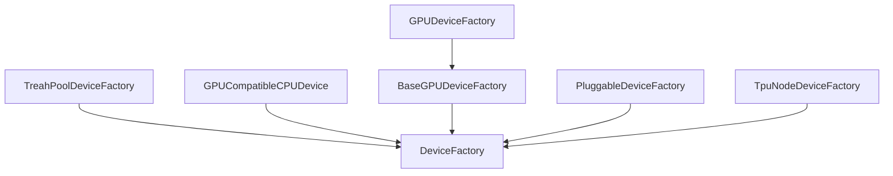

&emsp;这一节我们一起学习一下tensorflow的device。经过前面的介绍，我们能看出来tensorflow使用了很多factory设计模式，Device同样沿用这种设计，tensorflow设计了各种device的factory，以生成这种device对象。

tensorflow中有很多的DeviceFactory, 各个DeviceFactory的继承关系如下：




其中DeviceFactory是所有所有factory的父类，由其集成出的各类factory中用的最多的就是
>ThreadPoolDeviceFactory ：用于创建ThreadPoolDevice，是CPU Device 的实现 \
GPUCompatibleCPUDevice ：用于生成GPUCompatibleCPUDevice \
BaseGPUDeviceFactory && GPUDeviceFactory： 用于生成BaseGPUDevice和GPUDevice


其他factory比较少用到，而且从上面的三个就能大概明白factory的工作原理了。

## DeviceFactory
&emsp;首先看一下父类DeviceFactory的定义，DeviceFactory的定义放在tensorflow\core\framework\device_factory.h和tensorflow\core\framework\device_factory.cc中。DeviceFactory对象的定义是：
```cpp
class DeviceFactory {
 public:
  virtual ~DeviceFactory() {}
  static void Register(const std::string& device_type,
                       std::unique_ptr<DeviceFactory> factory, int priority,
                       bool is_pluggable_device);
  ABSL_DEPRECATED("Use the `Register` function above instead")
  static void Register(const std::string& device_type, DeviceFactory* factory,
                       int priority, bool is_pluggable_device) {
    Register(device_type, std::unique_ptr<DeviceFactory>(factory), priority,
             is_pluggable_device);
  }
  static DeviceFactory* GetFactory(const std::string& device_type);

  // Append to "*devices" CPU devices.
  static Status AddCpuDevices(const SessionOptions& options,
                              const std::string& name_prefix,
                              std::vector<std::unique_ptr<Device>>* devices);

  // Append to "*devices" all suitable devices, respecting
  // any device type specific properties/counts listed in "options".
  //
  // CPU devices are added first.
  static Status AddDevices(const SessionOptions& options,
                           const std::string& name_prefix,
                           std::vector<std::unique_ptr<Device>>* devices);

  // Helper for tests.  Create a single device of type "type".  The
  // returned device is always numbered zero, so if creating multiple
  // devices of the same type, supply distinct name_prefix arguments.
  static std::unique_ptr<Device> NewDevice(const string& type,
                                           const SessionOptions& options,
                                           const string& name_prefix);

  // Iterate through all device factories and build a list of all of the
  // possible physical devices.
  //
  // CPU is are added first.
  static Status ListAllPhysicalDevices(std::vector<string>* devices);

  // Iterate through all device factories and build a list of all of the
  // possible pluggable physical devices.
  static Status ListPluggablePhysicalDevices(std::vector<string>* devices);

  // Get details for a specific device among all device factories.
  // 'device_index' indexes into devices from ListAllPhysicalDevices.
  static Status GetAnyDeviceDetails(
      int device_index, std::unordered_map<string, string>* details);

  // For a specific device factory list all possible physical devices.
  virtual Status ListPhysicalDevices(std::vector<string>* devices) = 0;

  // Get details for a specific device for a specific factory. Subclasses
  // can store arbitrary device information in the map. 'device_index' indexes
  // into devices from ListPhysicalDevices.
  virtual Status GetDeviceDetails(int device_index,
                                  std::unordered_map<string, string>* details) {
    return OkStatus();
  }

  // Most clients should call AddDevices() instead.
  virtual Status CreateDevices(
      const SessionOptions& options, const std::string& name_prefix,
      std::vector<std::unique_ptr<Device>>* devices) = 0;

  // Return the device priority number for a "device_type" string.
  //
  // Higher number implies higher priority.
  //
  // In standard TensorFlow distributions, GPU device types are
  // preferred over CPU, and by default, custom devices that don't set
  // a custom priority during registration will be prioritized lower
  // than CPU.  Custom devices that want a higher priority can set the
  // 'priority' field when registering their device to something
  // higher than the packaged devices.  See calls to
  // REGISTER_LOCAL_DEVICE_FACTORY to see the existing priorities used
  // for built-in devices.
  static int32 DevicePriority(const std::string& device_type);

  // Returns true if 'device_type' is registered from plugin. Returns false if
  // 'device_type' is a first-party device.
  static bool IsPluggableDevice(const std::string& device_type);
};
```

在tensorflow\core\framework\device_factory.cc 中有一些基本的函数的实现，如下图所示


下面介绍一些常用的函数：
### Register
Register函数用于deviceFactory的注册。

```cpp
// static
void DeviceFactory::Register(const string& device_type,
                             std::unique_ptr<DeviceFactory> factory,
                             int priority, bool is_pluggable_device) {
  if (!IsDeviceFactoryEnabled(device_type)) {
    LOG(INFO) << "Device factory '" << device_type << "' disabled by "
              << "TF_ENABLED_DEVICE_TYPES environment variable.";
    return;
  }
  mutex_lock l(*get_device_factory_lock());
  std::unordered_map<string, FactoryItem>& factories = device_factories();
  auto iter = factories.find(device_type);
  if (iter == factories.end()) {
    factories[device_type] = {std::move(factory), priority,
                              is_pluggable_device};
  } else {
    if (iter->second.priority < priority) {
      iter->second = {std::move(factory), priority, is_pluggable_device};
    } else if (iter->second.priority == priority) {
      LOG(FATAL) << "Duplicate registration of device factory for type "
                 << device_type << " with the same priority " << priority;
    }
  }
}
```
在注册时，如果同一个device_type被注册两次，那么由FactoryItem的属性priority，来决定注册哪个deviceFactory。
#### device_factories
deviceFactory的注册信息被放在一个静态变量map中，这一点和sesssionFactory的注册是一样的。这个存储注册信息的变量定义如下：

```cpp
std::unordered_map<string, FactoryItem>& device_factories() {
  static std::unordered_map<string, FactoryItem>* factories =
      new std::unordered_map<string, FactoryItem>;
  return *factories;
}
```

这个思路和sessionFactory的注册一模一样。FactoryItem是一个结构体，定义如下：

```cpp
struct FactoryItem {
  std::unique_ptr<DeviceFactory> factory;
  int priority;
  bool is_pluggable_device;
};
```

### getFactory
getFactory函数,即根据key从注册map中获取DeviceFactory

```cpp
DeviceFactory* DeviceFactory::GetFactory(const string& device_type) {
  tf_shared_lock l(*get_device_factory_lock());
  auto it = device_factories().find(device_type);
  if (it == device_factories().end()) {
    return nullptr;
  } else if (!IsDeviceFactoryEnabled(device_type)) {
    LOG(FATAL) << "Device type " << device_type  // Crash OK
               << " had factory registered but was explicitly disabled by "
               << "`TF_ENABLED_DEVICE_TYPES`. This environment variable needs "
               << "to be set at program startup.";
  }
  return it->second.factory.get();
}
```

### NewDevice
&emsp;NewDevice函数，用于从deviceFActory生成一个Devices对象。入参是deviceFactory的key，根据key从注册map中找到对应的DeviceFactory，然后调用DeviceFactory的CreateDevices生成Device对象。CreateDevices是一个虚函数，具体的实现过程被写在各个子类中。

```cpp
std::unique_ptr<Device> DeviceFactory::NewDevice(const string& type,
                                                 const SessionOptions& options,
                                                 const string& name_prefix) {
  auto device_factory = GetFactory(type);
  if (!device_factory) {
    return nullptr;
  }
  SessionOptions opt = options;
  (*opt.config.mutable_device_count())[type] = 1;
  std::vector<std::unique_ptr<Device>> devices;
  TF_CHECK_OK(device_factory->CreateDevices(opt, name_prefix, &devices));
  int expected_num_devices = 1;
  auto iter = options.config.device_count().find(type);
  if (iter != options.config.device_count().end()) {
    expected_num_devices = iter->second;
  }
  DCHECK_EQ(devices.size(), static_cast<size_t>(expected_num_devices));
  return std::move(devices[0]);
}
```
### AddCpuDevices
AddCpuDevices是从注册的deviceFactory中获取cpu的device(在deviceFacotries中，每种deviceFactory只能注册一个，因为都是以设备名称为key，重复注册会相互覆盖），然后创建一个CreateDevices。

```cpp
Status DeviceFactory::AddCpuDevices(
    const SessionOptions& options, const string& name_prefix,
    std::vector<std::unique_ptr<Device>>* devices) {
  auto cpu_factory = GetFactory("CPU");
  if (!cpu_factory) {
    return errors::NotFound(
        "CPU Factory not registered. Did you link in threadpool_device?");
  }
  size_t init_size = devices->size();
  TF_RETURN_IF_ERROR(cpu_factory->CreateDevices(options, name_prefix, devices));
  if (devices->size() == init_size) {
    return errors::NotFound("No CPU devices are available in this process");
  }

  return OkStatus();
}
```

### AddDevices

```cpp
Status DeviceFactory::AddDevices(
    const SessionOptions& options, const string& name_prefix,
    std::vector<std::unique_ptr<Device>>* devices) {
  // CPU first. A CPU device is required.
  // TODO(b/183974121): Consider merge the logic into the loop below.
  TF_RETURN_IF_ERROR(AddCpuDevices(options, name_prefix, devices));

  auto cpu_factory = GetFactory("CPU");
  // Then the rest (including GPU).
  mutex_lock l(*get_device_factory_lock());
  for (auto& p : device_factories()) {
    auto factory = p.second.factory.get();
    if (factory != cpu_factory) {
      TF_RETURN_IF_ERROR(factory->CreateDevices(options, name_prefix, devices));
    }
  }

  return Status::OK();
}
```
### NewDevice、AddCpuDevices、AddDevices的区别

* NewDevice函数是创建一个device，并且返回，这个device可以是任何类型的device
* AddCpuDevices 是获取CPU类型的DeviceFacotry，在sessionoption中可能会配置多个cpu，就会创建读个cpu类型的Device。device 创建后不会返回，而是直接写入函数的入参std::vector<std::unique_ptr<Device>>* devices
* AddDevices 是创建所有类型的device，每个类型的device的数量取决于sessionoption，生成的device同样写入入参std::vector<std::unique_ptr<Device>>* devices
  
&emsp;&emsp;一般情况下，生成device只会调用DeviceFacotry的上面的三个函数，而不是调用具体的子类例如ThreadPoolDeviceFactory。在DeviceFacotry中会具体确定要生成什么类型的deivceFactory,并且调用相应的createDevice这些虚函数。这样可以保证代码的统一。

例如，我们要生成一个cpu和gpu类型的Device，只需要这样写
```cpp
DeviceFactory::NewDevice("CPU", options,"local")
DeviceFactory::NewDevice("GPU", options,"local")
```
在NewDevice 中会根据第一个参数获取相应的factory，生成对应的device。


### ListAllPhysicalDevices
&emsp;光从名字就能看出来这个函数用于列出所有的物理设备。其实是列举出被注册在deviceFactories的设备。这里说的物理设备其实还是对设备的抽象。这个函数由两部分组成，第一部分是列出CPU，CPU是必须要有的，如果没有找到CPU的deviceFacotries则会报错。找到CPU的factory后，通过factory的ListPhysicalDevices列出CPU，如果没有找到CPU设备，同样要报错。然后就是列出CPU以外的所有设备。

```cpp
Status DeviceFactory::ListAllPhysicalDevices(std::vector<string>* devices) {
  // CPU first. A CPU device is required.
  // TODO(b/183974121): Consider merge the logic into the loop below.
  auto cpu_factory = GetFactory("CPU");
  if (!cpu_factory) {
    return errors::NotFound(
        "CPU Factory not registered. Did you link in threadpool_device?");
  }

  size_t init_size = devices->size();
  TF_RETURN_IF_ERROR(cpu_factory->ListPhysicalDevices(devices));
  if (devices->size() == init_size) {
    return errors::NotFound("No CPU devices are available in this process");
  }

  // Then the rest (including GPU).
  tf_shared_lock l(*get_device_factory_lock());
  for (auto& p : device_factories()) {
    auto factory = p.second.factory.get();
    if (factory != cpu_factory) {
      TF_RETURN_IF_ERROR(factory->ListPhysicalDevices(devices));
    }
  }

  return Status::OK();
}
```

上面用到了ListPhysicalDevices，ListPhysicalDevices被实现在各种deviceFactory子类中。后面会有详细介绍。

## ThreadPoolDeviceFactory

ThreadPoolDeviceFactory 是 DeviceFactory的直接子类。定义在tensorflow/core/common_runtime/threadpool_device_factory.cc，由于太过简单，没有定义头文件。

ThreadPoolDeviceFactory的函数只有两个，ListPhysicalDevices和CreateDevices

### ListPhysicalDevices
在lDeviceFactory的ListAllPhysicalDevices被调用。该函数源码也非常简单：
```cpp
  Status ListPhysicalDevices(std::vector<string>* devices) override {
    devices->push_back("/physical_device:CPU:0");

    return Status::OK();
  }
```

这个代码非常有意思，他会直接返回0号cpu，也就是说，无论一个设备中有多少cpu，最终参与计算的就一个。

### CreateDevices
CreateDevices 是 实现了父类DeviceFactory 中的虚函数，这个函数在父类的AddDevices， NewDevice， AddCpuDevices被调用。
```cpp
Status CreateDevices(const SessionOptions& options, const string& name_prefix,
                       std::vector<std::unique_ptr<Device>>* devices) override {
    int num_numa_nodes = port::NUMANumNodes();
    int n = 1;
    auto iter = options.config.device_count().find("CPU");
    if (iter != options.config.device_count().end()) {
      n = iter->second;
    }
    for (int i = 0; i < n; i++) {
      string name = strings::StrCat(name_prefix, "/device:CPU:", i);
      std::unique_ptr<ThreadPoolDevice> tpd;
      if (options.config.experimental().use_numa_affinity()) {
        int numa_node = i % num_numa_nodes;
        if (numa_node != i) {
          LOG(INFO) << "Only " << num_numa_nodes
                    << " NUMA nodes visible in system, "
                    << " assigning device " << name << " to NUMA node "
                    << numa_node;
        }
        DeviceLocality dev_locality;
        dev_locality.set_numa_node(numa_node);
        tpd = absl::make_unique<ThreadPoolDevice>(
            options, name, Bytes(256 << 20), dev_locality,
            ProcessState::singleton()->GetCPUAllocator(numa_node));
      } else {
        tpd = absl::make_unique<ThreadPoolDevice>(
            options, name, Bytes(256 << 20), DeviceLocality(),
            ProcessState::singleton()->GetCPUAllocator(port::kNUMANoAffinity));
      }
      devices->push_back(std::move(tpd));
    }

    return Status::OK();
  }
  ```
CreateDevices用于生成一个ThreadPoolDevice,入参是SessionOptions格式的option，一个空的Device指针std::vector<std::unique_ptr<Device>>* devices。以及一个前缀，这个前缀一般会冠诸如”/job:localhost/replica:0/task:0“ 等信息。

其中SessionOptions 是一个结构体，其中一个属性是config，数据类型是ConfigProto， 由proto文件tensorflow/core/protobuf/config.proto定义。config也是在上面的代码中用到的属性，上面代码中的用法是

```cpp
options.config.device_count()
```

这段代码用于获取device_count， device_count 在 是ConfigProto的属性，是一个map<string, int32> 类型的map。这个map用于记录每种设备的最大使用数量。如果某种设备没有被记录在这个map中，则会大概估计一个数量。这个属性非常重要，用于确定device的数量。

接下来的代码关于numa的部分可以不管，numa是一种内存分配方案，有兴趣可以单独去学习。核心的代码的就是

```cpp
  tpd = absl::make_unique<ThreadPoolDevice>(
      options, name, Bytes(256 << 20), DeviceLocality(),
      ProcessState::singleton()->GetCPUAllocator(port::kNUMANoAffinity));
```
总结一下，就是从sessionoption中读取配置确定配置了n个设备，然后新建n个ThreadPoolDevice对象，关于ThreadPoolDevice 可以看Device一章的内容。

GP

### BaseGPUDeviceFactory

BaseGPUDeviceFactory的代码在tensorflow/core/common_runtime/gpu/gpu_device.h和 tensorflow/core/common_runtime/gpu/gpu_device.cc，同时BaseGPUDevice 的代码也在这个路径中。


