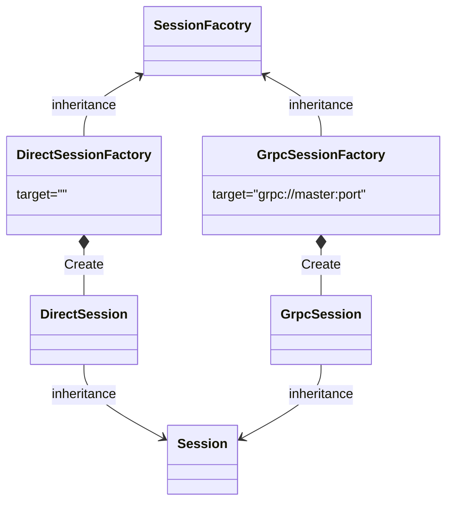

&emsp;从这一节开始学一下session，session是一个比较难的地方，涉及的代码量非常大。会分成几部分讲，这一节先讲SessionFactory。

&emsp;SessionFactory是用于生成session的对象，session的类型有两种，分别是DirectionSession和GrpcSession，分别对应单机训练和分布式训练。因此SessionFactory也有两种分别是DirectionSessionFactory和GrpcSessionFactory。

&emsp;DirectionSessionFactory和GrpcSessionFactory都继承自SessionFactory。各个对象之间的关系如下图所示。




## SessionFacotry
&emsp;首先来看SessionFactory的源码

```cpp
class SessionFactory {
 public:
  // Creates a new session and stores it in *out_session, or fails with an error
  // status if the Session could not be created. Caller takes ownership of
  // *out_session if this returns Status::OK().
  virtual Status NewSession(const SessionOptions& options,
                            Session** out_session) = 0;

  virtual bool AcceptsOptions(const SessionOptions& options) = 0;

  // Abort and close all existing sessions, disconnecting their resources from
  // future sessions.
  //
  // Reset() allows misbehaving or slow sessions to be aborted and closed, and
  // causes their resources eventually to be released.  Reset() does not wait
  // for the computations in old sessions to cease; it merely starts the
  // process of tearing them down.  However, if a new session is started after
  // a Reset(), the new session is isolated from changes that old sessions
  // (started prior to the Reset()) may continue to make to resources, provided
  // all those resources are in containers listed in "containers".
  //
  // Old sessions may continue to have side-effects on resources not in
  // containers listed in "containers", and thus may affect future
  // sessions' results in ways that are hard to predict.  Thus, if well-defined
  // behavior is desired, is it recommended that all containers be listed in
  // "containers".
  //
  // If the "containers" vector is empty, the default container is assumed.
  // If the "containers" vector is non-empty, the default container should be
  // listed explicitly.
  //
  // Sessions that support resource containers should override this function.
  virtual Status Reset(const SessionOptions& options,
                       const std::vector<string>& containers) {
    return errors::Unimplemented("Reset()");
  }

  virtual ~SessionFactory() {}
  static void Register(const string& runtime_type, SessionFactory* factory);
  static Status GetFactory(const SessionOptions& options,
                           SessionFactory** out_factory);
};
```

核心的函数是
> 构造函数 \
>NewSession \
>AcceptsOptions \
>GetFactory 


### SessionFactories和session_factories()
除了对象的成员函数之外，还有一个比较重要的变量和函数SessionFactories和session_factories()

```cpp
typedef std::unordered_map<string, SessionFactory*> SessionFactories;
SessionFactories* session_factories() {
  static SessionFactories* factories = new SessionFactories;
  return factories;
}
```

SessionFactories是一个用于注册SessionFactory的map。key是”DIRECT_SESSION“或者是”GRPC_SESSION“。session_factories函数生成了一个静态的SessionFactories，保证所有的注册数据都写入同一个变量中。SessionFactories这个变量只会初始化一次，这在[c++中static变量的初始化](https://github.com/szkang1990/blog/blob/main/c%2B%2B%E5%AD%A6%E4%B9%A0%E7%AC%94%E8%AE%B0/c%2B%2B%E4%B8%ADstatic%E5%8F%98%E9%87%8F%E5%88%9D%E5%A7%8B%E5%8C%96.md)中有介绍


### Register函数
Register函数调用session_factories()获得格式是静态变量的SessionFactories，并且向其中写注册信息。
```cpp
void SessionFactory::Register(const string& runtime_type,
                              SessionFactory* factory) {
  mutex_lock l(*get_session_factory_lock());
  if (!session_factories()->insert({runtime_type, factory}).second) {
    LOG(ERROR) << "Two session factories are being registered "
               << "under" << runtime_type;
  }
}
```


### GetFactory函数
getFactory函数是从注册信息SessionFactories中获取目的SessionFactory

```cpp
Status SessionFactory::GetFactory(const SessionOptions& options,
                                  SessionFactory** out_factory) {
  mutex_lock l(*get_session_factory_lock());  // could use reader lock

  std::vector<std::pair<string, SessionFactory*>> candidate_factories;
  for (const auto& session_factory : *session_factories()) {
    if (session_factory.second->AcceptsOptions(options)) {
      VLOG(2) << "SessionFactory type " << session_factory.first
              << " accepts target: " << options.target;
      candidate_factories.push_back(session_factory);
    } else {
      VLOG(2) << "SessionFactory type " << session_factory.first
              << " does not accept target: " << options.target;
    }
  }

  if (candidate_factories.size() == 1) {
    *out_factory = candidate_factories[0].second;
    return OkStatus();
  } else if (candidate_factories.size() > 1) {
    // NOTE(mrry): This implementation assumes that the domains (in
    // terms of acceptable SessionOptions) of the registered
    // SessionFactory implementations do not overlap. This is fine for
    // now, but we may need an additional way of distinguishing
    // different runtimes (such as an additional session option) if
    // the number of sessions grows.
    // TODO(mrry): Consider providing a system-default fallback option
    // in this case.
    std::vector<string> factory_types;
    factory_types.reserve(candidate_factories.size());
    for (const auto& candidate_factory : candidate_factories) {
      factory_types.push_back(candidate_factory.first);
    }
    return errors::Internal(
        "Multiple session factories registered for the given session "
        "options: {",
        SessionOptionsToString(options), "} Candidate factories are {",
        absl::StrJoin(factory_types, ", "), "}. ",
        RegisteredFactoriesErrorMessageLocked());
  } else {
    return errors::NotFound(
        "No session factory registered for the given session options: {",
        SessionOptionsToString(options), "} ",
        RegisteredFactoriesErrorMessageLocked());
  }
}
```
在上面的代码中，首先创建了一个SessionFactory的vector  candidate_factories，然后调用AcceptsOptions遍历筛选SessionFactories中的SessionFactory，如果将筛选结果写入candidate_factories。AcceptsOptions的筛选方法，读取SessionOptions 中的配置，如果和SessionFactories中的匹配，就返回True。

如果AcceptsOptions返回true了，说明有DirectionSessionFactory和GrpcSessionFactory被注册在SessionFactories。而且和option相匹配。则把相应的SessionFactory放进candidate_factory。正常情况下，option只能和一种SessionFactory匹配，即有且仅有一种SessionFactory被放进candidate_factory，

在遍历过SessionFactories以后，如果candidate_factories中的元素不等于1，则抛出错误。

AcceptsOptions是一个虚函数，在各个子类中实现。

注意这个时候只是完成了SessionFactory，还没有创建session，创建session的需要调用SessionFactory的NewSession实现。NewSession也是


## DirectSessionFactory

DirectSessionFactory的源码在tensorflow/core/common_runtime/direct_session.cc 和 tensorflow/core/common_runtime/direct_session.h中，在这个文件中还有DirectSession的代码

### AcceptsOptions函数
上面已经介绍了，AcceptsOptions用于匹配sessionoption和sesionfactories
在DirectSessionFactory中AcceptsOptions的代码是：
```cpp
  // DirectionSessionFactory定义
  bool AcceptsOptions(const SessionOptions& options) override {
    return options.target.empty() &&
           !options.config.experimental().use_tfrt() &&
           GetDefaultLocalSessionImpl() == LocalSessionImpl::kDirectSession;
  }

  // GrpcSessionFactory 定义
  bool AcceptsOptions(const SessionOptions& options) override {
    return absl::StartsWith(options.target, kSchemePrefix);
  }
```

大概含义是通过一系列的条件(例如target是否为空)判断option是否是单机运行的option，如果是则返回true。其中options.target为空的时候，就和上面图中的内容对应。


### NewSession函数

NewSession也是在SessionFactory中被定义的虚函数，由子类DirectionSessionFactory和GrpcSessionFactory实现。下面来看一下实现过程：

```cpp
  // DirectionSessionFactory 实现过程
  Status NewSession(const SessionOptions& options,
                    Session** out_session) override {
    const auto& experimental_config = options.config.experimental();
    if (experimental_config.has_session_metadata()) {
      if (experimental_config.session_metadata().version() < 0) {
        return errors::InvalidArgument(
            "Session version shouldn't be negative: ",
            experimental_config.session_metadata().DebugString());
      }
      const string key = GetMetadataKey(experimental_config.session_metadata());
      mutex_lock l(sessions_lock_);
      if (!session_metadata_keys_.insert(key).second) {
        return errors::InvalidArgument(
            "A session with the same name and version has already been "
            "created: ",
            experimental_config.session_metadata().DebugString());
      }
    }

    // Must do this before the CPU allocator is created.
    if (options.config.graph_options().build_cost_model() > 0) {
      EnableCPUAllocatorFullStats();
    }
    std::vector<std::unique_ptr<Device>> devices;
    TF_RETURN_IF_ERROR(DeviceFactory::AddDevices(
        options, "/job:localhost/replica:0/task:0", &devices));

    DirectSession* session = new DirectSession(
        options, new StaticDeviceMgr(std::move(devices)), this);
    {
      mutex_lock l(sessions_lock_);
      sessions_.push_back(session);
    }
    *out_session = session;
    return OkStatus();
  }

```

在NewSession中，首先是一些列的session信息的判断，例如option中的session_metadata version不能为负值，session_metadata的不能重名等。
核心部分是
```cpp
    std::vector<std::unique_ptr<Device>> devices;
    TF_RETURN_IF_ERROR(DeviceFactory::AddDevices(
        options, "/job:localhost/replica:0/task:0", &devices));

    DirectSession* session = new DirectSession(
        options, new StaticDeviceMgr(std::move(devices)), this);
    {
      mutex_lock l(sessions_lock_);
      sessions_.push_back(session);
    }
    *out_session = session;
```
代码比较简单，就是调用DeviceFactory::AddDevices 生成了所用要用到的device，并且写入std::vector<std::unique_ptr<Device>> devices。这里有一个细节需要注意一下，在单机训练的环境下，device的前缀是/job:localhost/replica:0/task:0，说明单机环境整个任务只有一个task。

生成devices以后，以devices为入参创建一个DirectSession，并且赋值给入参out_session


### DirectSession构造函数
```cpp
DirectSession::DirectSession(const SessionOptions& options,
                             const DeviceMgr* device_mgr,
                             DirectSessionFactory* const factory)
    : options_(options),
      device_mgr_(device_mgr),
      factory_(factory),
      cancellation_manager_(new CancellationManager()),
      operation_timeout_in_ms_(options_.config.operation_timeout_in_ms()) {
  const int thread_pool_size =
      options_.config.session_inter_op_thread_pool_size();
  if (thread_pool_size > 0) {
    for (int i = 0; i < thread_pool_size; ++i) {
      thread::ThreadPool* pool = nullptr;
      bool owned = false;
      init_error_.Update(NewThreadPoolFromThreadPoolOptions(
          options_, options_.config.session_inter_op_thread_pool(i), i, &pool,
          &owned));
      thread_pools_.emplace_back(pool, owned);
    }
  } else if (options_.config.use_per_session_threads()) {
    thread_pools_.emplace_back(NewThreadPoolFromSessionOptions(options_),
                               true /* owned */);
  } else {
    thread_pools_.emplace_back(GlobalThreadPool(options), false /* owned */);
    // Run locally if environment value of TF_NUM_INTEROP_THREADS is negative
    // and config.inter_op_parallelism_threads is unspecified or negative.
    static const int env_num_threads = NumInterOpThreadsFromEnvironment();
    if (options_.config.inter_op_parallelism_threads() < 0 ||
        (options_.config.inter_op_parallelism_threads() == 0 &&
         env_num_threads < 0)) {
      run_in_caller_thread_ = true;
    }
  }
  // The default value of sync_on_finish will be flipped soon and this
  // environment variable will be removed as well.
  const Status status =
      ReadBoolFromEnvVar("TF_SYNC_ON_FINISH", true, &sync_on_finish_);
  if (!status.ok()) {
    LOG(ERROR) << status.error_message();
  }
  session_handle_ =
      strings::StrCat("direct", strings::FpToString(random::New64()));
  int devices_added = 0;
  if (options.config.log_device_placement()) {
    const string mapping_str = device_mgr_->DeviceMappingString();
    string msg;
    if (mapping_str.empty()) {
      msg = "Device mapping: no known devices.";
    } else {
      msg = strings::StrCat("Device mapping:\n", mapping_str);
    }
    if (!logging::LogToListeners(msg)) {
      LOG(INFO) << msg;
    }
  }
  for (auto d : device_mgr_->ListDevices()) {
    devices_.push_back(d);
    device_set_.AddDevice(d);
    d->op_segment()->AddHold(session_handle_);

    // The first device added is special: it is the 'client device' (a
    // CPU device) from which we feed and fetch Tensors.
    if (devices_added == 0) {
      device_set_.set_client_device(d);
    }
    ++devices_added;
  }
}
```


