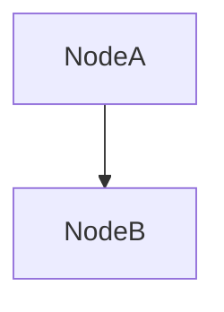

shaperRefiner是形状推理相关的对象，在自定义op的时候会有涉及，一般这个对象会和graph一起绑定在TF_graph这个结构体中。

# ShapeRefiner

## 基本属性
ShapeRefiner的基本属性 如下

```cpp
 int32 graph_def_version_;
  const OpRegistryInterface* const ops_registry_;

  // The lifetime of the tensors are bound to the runner, so it should be the
  // deleted after the tensors.
  GraphRunner graph_runner_;

  // Stores a map from a node to its ExtendedInferenceContext.
  absl::flat_hash_map<const Node*, std::unique_ptr<ExtendedInferenceContext>,
                      hash<const Node*>>
      node_to_context_;

  // Holds a cache from 'tensor name' to the tensor that is
  // evaluatable as a constant expression.  This reduces repeated
  // execution of the entire constant subgraph as a graph is being
  // built up.  This could be changed to some kind of size-based LRU
  // cache to avoid consuming too much memory, if that eventually
  // becomes a concern.
  //
  // Only tensors less than 1KiB are currently stored in the cache.
  static constexpr int64_t kMaxTensorSize = 1024;
  std::unordered_map<string, Tensor> const_tensor_map_;

  bool require_shape_inference_fns_ = true;
  bool disable_constant_propagation_ = false;

  // Function library is optional, but has to be set to enable function
  // shape inference.
  const tensorflow::FunctionLibraryDefinition* function_library_ = nullptr;

  // Cache the graph corresponding to each function definition for which shapes
  // are refined.
  absl::flat_hash_map<const FunctionDef*, std::unique_ptr<const Graph>,
                      hash<const FunctionDef*>>
      functions_;
```
ops_registry_ 在graph和op注册中已经提过很多次。

GraphRunner graph_runner_; 后面再讲

absl::flat_hash_map<const Node*, std::unique_ptr<ExtendedInferenceContext>, hash<const Node*>> node_to_context_;  一个map从Node映射到ExtendedInferenceContext， InferenceContext在op中我们就见过。是形状推理函数的输入。ExtendedInferenceContext和ExtendedInferenceContext。同样后面再讲

static constexpr int64_t kMaxTensorSize = 1024;  Tensor缓存不用关注
std::unordered_map<string, Tensor> const_tensor_map_;  tensorName -> Tensor的map
const tensorflow::FunctionLibraryDefinition* function_library_ = nullptr;  作用和ops_registry_ 类似


## 构造函数


```cpp
ShapeRefiner::ShapeRefiner(int graph_def_version,
                           const OpRegistryInterface* ops)
    : graph_def_version_(graph_def_version),
      ops_registry_(ops),
      graph_runner_(Env::Default()) {}

ShapeRefiner::ShapeRefiner(const VersionDef& versions,
                           const OpRegistryInterface* ops)
    : ShapeRefiner(versions.producer(), ops) {}
```


ShapeRefiner的构造函数就是给graph_def_version_， ops_registry_， graph_runner_初始化。

主要来看看graph_runner_这个对象

### GrpahRunner
 graphrunner代码路径是tensorflow/core/common_runtime/graph_runner.h， graphrunner是运行图的对象。代码非常简单：
```cpp
class GraphRunner {
 public:
  // REQUIRES: `env` is not nullptr.
  GraphRunner(Env* env);
  // REQUIRES: 'device' is not nullptr. Not owned.
  GraphRunner(Device* device);
  ~GraphRunner();

  // Function semantics for `inputs`, `output_names` and `outputs`
  // matches those from Session::Run().
  //
  // NOTE: The output tensors share lifetime with the GraphRunner, and could
  // be destroyed once the GraphRunner is destroyed.
  //
  // REQUIRES: `graph`, `env`, and `outputs` are not nullptr.
  // `function_library` may be nullptr.
  typedef std::vector<std::pair<string, Tensor>> NamedTensorList;
  Status Run(Graph* graph, FunctionLibraryRuntime* function_library,
             const NamedTensorList& inputs,
             const std::vector<string>& output_names,
             std::vector<Tensor>* outputs);

 private:
  std::unique_ptr<Device> device_deleter_;
  Device* const device_;
};

```
我们先来看构造函数

```cpp
GraphRunner::GraphRunner(Env* env)
    : device_deleter_(NewSingleThreadedCpuDevice(env)),
      device_(device_deleter_.get()) {}
GraphRunner::GraphRunner(Device* device) : device_(device) {}
```
GraphRunner的初始化就是为了给device_ 这个属性赋值，给device赋值的device类型是NewSingleThreadedCpuDevice，是一个单线程的设备。

graphrunner还有唯一的函数run

```cpp
Status GraphRunner::Run(Graph* graph, FunctionLibraryRuntime* function_library,
                        const NamedTensorList& inputs,
                        const std::vector<string>& output_names,
                        std::vector<Tensor>* outputs) {
  if (device_ == nullptr) {
    return errors::NotFound("Cannot find a device for GraphRunner.");
  }

  if (function_library && function_library->device() &&
      function_library->device()->device_type() != device_->device_type()) {
    // Mismatch between function_library's device_type and device_'s
    // device_type.
    // TODO(matthewmurray) Can we create a new FunctionLibraryRuntime that is
    // identical to function_library except that it uses the given 'device_'?
    VLOG(1) << "Cannot run on: " << device_->device_type()
            << " with a function library for a "
            << function_library->device()->device_type() << " device.";
    function_library = nullptr;
  }

  // TODO(vrv): Instead of copying the entire graph, consider modifying
  // the existing graph, and then removing those removed edges.
  // prior to returning.
  std::unique_ptr<Graph> graph_to_run(new Graph(graph->op_registry()));
  CopyGraph(*graph, graph_to_run.get());

  SimpleRendezvous rendez;

  // Extract the input names and keys, and feed in the inputs.
  std::vector<string> input_names;
  for (const auto& in : inputs) {
    const string& tensor_name = in.first;
    input_names.emplace_back(tensor_name);
    string full_key = Rendezvous::CreateKey("/device:CPU:0", 1, "/device:CPU:1",
                                            tensor_name, FrameAndIter(0, 0));
    Rendezvous::ParsedKey parsed;
    TF_RETURN_IF_ERROR(Rendezvous::ParseKey(full_key, &parsed));
    TF_RETURN_IF_ERROR(rendez.Send(parsed, Rendezvous::Args(), in.second,
                                   false /* is_dead */));
  }

  // Call RewriteGraphForExecution
  subgraph::RewriteGraphMetadata metadata;
  TF_RETURN_IF_ERROR(subgraph::RewriteGraphForExecution(
      graph_to_run.get(), input_names, output_names, {} /* target nodes */,
      device_->attributes(), false /* use_function_convention */, &metadata));

  // Create the local executor and the Rendezvous for fetching back the
  // constants.

  // Run operators on the local thread. We should not need concurrency here; we
  // should not be running expensive operators.
  auto runner = [](Executor::Args::Closure c) { c(); };

  LocalExecutorParams params;
  // The ownership of the output tensors are bound to this device's lifetime.
  params.device = device_;
  params.function_library = function_library;
  const int producer = graph_to_run->versions().producer();
  params.create_kernel = [this, function_library, producer](
                             const std::shared_ptr<const NodeProperties>& props,
                             OpKernel** kernel) {
    return CreateNonCachedKernel(device_, function_library, props, producer,
                                 kernel);
  };
  params.delete_kernel = [](OpKernel* kernel) { delete kernel; };

  Executor* executor;
  TF_RETURN_IF_ERROR(NewLocalExecutor(params, *graph_to_run, &executor));
  std::unique_ptr<Executor> executor_unref(executor);

  Executor::Args args;
  // NOTE: we could take a step id as an argument, but currently
  // there is no need since we never trace the running of a graph
  // called via this method.
  args.step_id = LogMemory::CONSTANT_FOLDING_STEP_ID;
  args.runner = runner;
  args.rendezvous = &rendez;
  // NOTE: Use of graph runner is limited to single-device executions
  // so a CollectiveExecutor should never be required.
  args.collective_executor = nullptr;

  CancellationManager cancellation_manager;
  args.cancellation_manager = &cancellation_manager;

  // Run the graph.
  TF_RETURN_IF_ERROR(executor->Run(args));

  outputs->resize(output_names.size());
  for (size_t i = 0; i < output_names.size(); ++i) {
    const string& output_key =
        Rendezvous::CreateKey("/device:CPU:0", 1, "/device:CPU:1",
                              output_names[i], FrameAndIter(0, 0));
    Rendezvous::ParsedKey parsed;
    TF_RETURN_IF_ERROR(Rendezvous::ParseKey(output_key, &parsed));
    bool is_dead;
    Tensor output_tensor;
    TF_RETURN_IF_ERROR(
        rendez.Recv(parsed, Rendezvous::Args(), &output_tensor, &is_dead));
    // Does a deep copy so that ownership of the tensor isn't tied to the
    // allocator of the cpu device we created above. The allocator could be
    // deleted along with the device.
    (*outputs)[i] = tensor::DeepCopy(output_tensor);
  }

  return Status::OK();
}
```
run函数就是运行graph的过程，输入一张图，指定输入和输出，GraphRunner可以执行这张图，计算得到输出。这个类仅供内部使用，它被用来局部的计算图中的非复杂节点，比如形状推断或者常量折叠。由于它的局限性，它所有的计算都将在CPU上进行，并且不具备轻量级、快速和高效等特点。

## 主要函数

### addNode

每当一个新的node加入到图中，shaperefiner会同步添加该节点，并且进行形状推断。这个过程
```cpp
Status ShapeRefiner::AddNode(const Node* node) {
  return AddNodeInternal(node, /*outer_context=*/nullptr);
}
```

### AddNodeInternal

```cpp
Status ShapeRefiner::AddNodeInternal(
    const Node* node, shape_inference::InferenceContext* outer_context) {
  // Create the inference context for this node with the existing input shapes.
  std::unique_ptr<InferenceContext> ic(new InferenceContext(
      graph_def_version_, node->def(), node->op_def(),
      std::vector<ShapeHandle>(node->num_inputs()), {}, {}, {}));
  TF_RETURN_IF_ERROR(ic->construction_status());

  // For each 'input' of this node, fetch the corresponding shape
  // from 'input's InferenceContext, and store into this node's
  // InferenceContext.
  for (const Edge* e : node->in_edges()) {
    if (e->IsControlEdge()) continue;

    if (e->dst_input() < 0) {
      return tensorflow::errors::Internal(
          "Index ", e->dst_input(), " is negative but not a control edge.");
    }

    const Node* input = e->src();
    auto it = node_to_context_.find(input);
    if (it == node_to_context_.end()) {
      // v1 control flow adds loops to the graph; we have to break them
      // somewhere, so we'll ignore this input and leave its shape undefined.
      ic->SetInput(e->dst_input(), ic->UnknownShape());
      continue;
    }

    InferenceContext* input_ic = it->second->get_context();
    ic->SetInput(e->dst_input(), input_ic->output(e->src_output()));

    const auto* in_v =
        input_ic->output_handle_shapes_and_types(e->src_output());
    if (in_v != nullptr) {
      DataType input_type = e->src()->output_type(e->src_output());
      DCHECK(input_type == DT_RESOURCE || input_type == DT_VARIANT);
      ic->set_input_handle_shapes_and_types(e->dst_input(),
                                            std::vector<ShapeAndType>(*in_v));
    }
  }

  // Get the shape function for this node
  const OpRegistrationData* op_reg_data;
  TF_RETURN_IF_ERROR(ops_registry_->LookUp(node->type_string(), &op_reg_data));
  if (op_reg_data->shape_inference_fn == nullptr &&
      require_shape_inference_fns_) {
    return errors::InvalidArgument(
        "No shape inference function exists for op '", node->type_string(),
        "', did you forget to define it?");
  }

  std::unique_ptr<ExtendedInferenceContext> ec(
      new ExtendedInferenceContext(std::move(ic), node));

  // Run the shape inference function, and return if there was an error.
  TF_RETURN_IF_ERROR(RunShapeFn(node, op_reg_data, ec.get(), outer_context));

  // Store the resulting context object in the map.
  node_to_context_[node].swap(ec);

  return Status::OK();
}
```

这段代码真的进行形状推断，根据输入计算输出的形状。这个过程中，非常频繁的用到了InferenceContext和 ExtendedInferenceContext的代码。 他们的代码咋inferecneContext中有详细的介绍。这里能看出来的，shaperefiner和inferenceContext分工是很明确的，shaperefiner负责整体的形状推断的流程，对每个node，shaperefiner创建一个inferenceContext，同时先从node上获取edge表示的node的每个输入, 然后根据每个edge获取相应的上游node，获取这些上游node的输出的形状，也就是目标node的输入的形状。

具体流程如下：


以上图为例，我们要对NodeB做形状推断
1. 为目标节点创建一个inferenceContext对象，其中仅仅初始化了graph_version, node_def, op_def, node的输入个数。
2. 通过node->in_edges()获取目标节点的所有输入边，并遍历之
3. 对于遍历的某个边，我们可以通过e->dst_input()获取这个边是目标节点的第几个输入边
4. 对于这个边的上游nodeA，如果node_to_context_中没有保存这个上游nodeA，则通过SetInput为这个位置的输入安排一个位置形状的输入。node_to_context_，是一个map，key是node，value是这个node的inferencecontext。表示node和inference的对应关系。如果node_to_context_中保存了这个nodeA，那么我么你就可以从node_to_context_取出这个NodeA对应的inferencecontext。我们可以通过src_output函数从edgs中知道这个edge是NodeA的第几个输出，然后用output函数获取这个输出的形状。这个形状就是NodeB的输入的形状。同样的手段，我们可以设置nodeB的input_handle_shapes_and_types属性
5. 经过上面的过程，我们就把一个node的输入全部获取完了并且写入到了inferenceContext中。然后从op注册信息中获取op注册时写的形状推理函数
6. 调用RunShapeFn，进行形状推断。RunShapeFn就是调用op注册信息中的推断函数，具体可以看代码，这里就不多赘述了。


   


