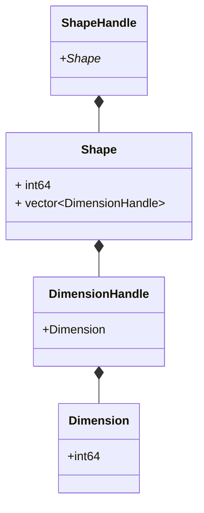

本届介绍一下tensorflow中关于形状的一些对象。
首先介绍一下Shape家族

# ShapeHandle
ShapeHandle的代码路径在tensorflow\core\framework\shape_inference.h，源码如下：

```cpp
class ShapeHandle {
 public:
  ShapeHandle() {}
  bool SameHandle(ShapeHandle s) const { return ptr_ == s.ptr_; }
  std::size_t Handle() const { return reinterpret_cast<std::size_t>(ptr_); }

 private:
  ShapeHandle(const Shape* shape) { ptr_ = shape; }
  const Shape* operator->() const { return ptr_; }
  bool IsSet() const { return ptr_ != nullptr; }

  const Shape* ptr_ = nullptr;

  friend class InferenceContext;
  friend class ShapeInferenceTest;
  friend class ShapeInferenceTestutil;
  friend class ::tensorflow::grappler::SymbolicShapeManager;

  // Intentionally copyable.
};
```
ShapeHandle 的属性非常简单就一个Shape类型的指针const Shape* ptr_ = nullptr;
构造函数也很简单，输入一个shapeShapeHandle(const Shape* shape)
其他函数同样简单，例如SameHandle(ShapeHandle s) 判断是否与入参是相同
值得一提的是，这里重载了符号 -> 会返回属性ptr_

所以说ShapeHandle本质上就是Shape指针的封装

# Shape

shape的源码也在tensorflow\core\framework\shape_inference.h，源码如下：
```cpp
class Shape {
 private:
  Shape();
  Shape(const std::vector<DimensionHandle>& dims);
  ~Shape() {}

  const int32 rank_;
  const std::vector<DimensionHandle> dims_;

  friend class InferenceContext;
  friend class ::tensorflow::grappler::SymbolicShapeManager;

  TF_DISALLOW_COPY_AND_ASSIGN(Shape);
};
```
他有两个属性：
```cpp
  const int32 rank_;
  const std::vector<DimensionHandle> dims_;
```
其中rank_ 表示shape的形状的长度，例如一个tensor是
<pre> [[[1]],[[2]]] </pre>
那么tensor的形状是[2,1,1]，[2,1,1]的长度是3，所以rank_就是3

dims_是一个DimensionHandle数组，长度是rank_，表示每个维度上的值

# DimensionHandle
DimensionHandle 的代码路径也在tensorflow\core\framework\shape_inference.h，源码如下：

```cpp

class DimensionHandle {
 public:
  DimensionHandle() {}
  bool SameHandle(DimensionHandle d) const { return ptr_ == d.ptr_; }
  std::size_t Handle() const { return reinterpret_cast<std::size_t>(ptr_); }

 private:
  DimensionHandle(const Dimension* dim) { ptr_ = dim; }

  const Dimension* operator->() const { return ptr_; }
  bool IsSet() const { return ptr_ != nullptr; }

  const Dimension* ptr_ = nullptr;

  friend struct DimensionOrConstant;
  friend class InferenceContext;
  friend class ShapeInferenceTest;
  friend class ShapeInferenceTestutil;
  friend class ::tensorflow::grappler::GraphProperties;
  friend class ::tensorflow::grappler::SymbolicShapeManager;

  // Intentionally copyable.
};
```

DimensionHandle和ShapeHandle非常类似，属性只有一个指针，构造函数和成员函数简单，所以就不赘述了

# Dimension

Dimension的代码路径也在tensorflow\core\framework\shape_inference.h，源码如下：

```cpp
class Dimension {
 private:
  Dimension();
  Dimension(int64_t value);
  ~Dimension() {}

  const int64_t value_;

  friend class InferenceContext;
  friend class ShapeManager;
  TF_DISALLOW_COPY_AND_ASSIGN(Dimension);
};
```
Dimension 本质上就是一个Int64，不赘述了





# ShapeManager
ShapeManager的源码位置在tensorflow/core/framework/shape_inference.h, 源码如下

```cpp
  class ShapeManager {
   public:
    ShapeManager();
    ~ShapeManager();

    // Returns a new shape with the given dims. The returned value is owned by
    // this class.
    ShapeHandle MakeShape(const std::vector<DimensionHandle>& dims);

    // Returns a new unknown shape.
    ShapeHandle UnknownShape();

    // Returns a new dimension of the given size.  The returned value
    // is owned by this class.
    inline DimensionHandle MakeDim(DimensionOrConstant d) {
      if (d.dim.IsSet()) {
        return d.dim;
      } else {
        all_dims_.push_back(new Dimension(d.val));
        return all_dims_.back();
      }
    }

   private:
    std::vector<Shape*> all_shapes_;    // values are owned.
    std::vector<Dimension*> all_dims_;  // values are owned.
  };
```
本质上就是对Shape和Dimension的封装，用于形状推断，例如某个节点有三个输入，那么std::vector<Shape*> all_shapes_会存入这三个输入的Shape

# DimensionOrConstant

DimensionOrConstant代码地址在tensorflow/core/framework/shape_inference.h，代码如下，非常简单，就是对DimensionHandle一层封装。

```cpp
struct DimensionOrConstant {
 public:
  // Intentionally not explicit.
  DimensionOrConstant(DimensionHandle dim);

  // val must be non-negative or InferenceContext::kUnknownDim.
  DimensionOrConstant(int64_t val);

  // dim takes precedence. If dim != nullptr, val is ignored.
  DimensionHandle dim;
  int64_t val;

 private:
  DimensionOrConstant();
};
```

# ShapeAndType

ShapeAndType的源码在tensorflow/core/framework/shape_inference.h 具体代码如下，是对shapehandle和Datatype的简单的封装。
```cpp
struct ShapeAndType {
  ShapeAndType() {}
  ShapeAndType(ShapeHandle s, DataType t) : shape(s), dtype(t) {}
  // TODO(mdan): Remove dtype from constructor, and use type_ instead.
  // dtype is kept here for backward compatibiity. Its information should
  // be redundant to that in type;
  ShapeAndType(ShapeHandle s, DataType t, FullTypeDef type_)
      : shape(s), dtype(t), type(type_) {}

  ShapeHandle shape;
  DataType dtype = DT_INVALID;
  FullTypeDef type;
};
```


# TensorShape

TensorShape的定义在tensorflow\core\framework\tensor_shape.h，源码如下


# PartialTensorShape

TensorShape的定义在tensorflow\core\framework\tensor_shape.h，源码如下


